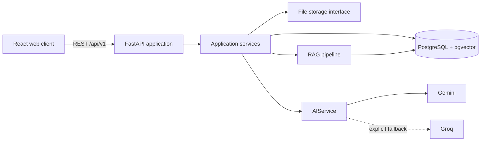

# Workflix


Workflix is a multi-tenant corporate learning and knowledge platform designed to centralize training, procedures, documents, assessments, and evidence of progress in one measurable experience.

> Project status: Phase 1 foundation is implemented. Authentication and product domains are intentionally tracked as the next phases, not represented by permanent mocks.

## Overview

Companies often distribute important knowledge across shared drives, email threads, video links, PDFs, and internal folders. That fragmentation makes simple operational questions surprisingly hard: Who completed mandatory training? Which procedure is current? Who still needs to acknowledge a policy? What content applies to a role?

Workflix treats those questions as a product and architecture problem, not as a generic CRUD exercise. The platform combines a polished discovery experience with tenant-safe workflows, durable completion evidence, document intelligence, and operational observability.

## Problem

Fragmented corporate knowledge creates concrete risk:

- employees cannot reliably find the current procedure;
- managers lack completion and expiration visibility;
- administrators repeat manual assignment and reporting work;
- companies cannot prove that a person completed or acknowledged required material;
- AI over private documents can cross security boundaries when tenancy is added as an afterthought.

## Solution

Workflix provides one company-scoped catalog for learning and knowledge, backed by explicit assignments, progress, assessments, document versions, and audit events. Its architecture starts multi-tenant, migration-owned, API-first, and provider-neutral so later AI features do not compromise the core security model.

## Features

### Available in the foundation

- Responsive React/Vite experience with a distinct Workflix identity.
- Typed server state through TanStack Query and runtime response validation through Zod.
- FastAPI application factory with versioned routes and OpenAPI documentation.
- Stable error envelopes and correlation IDs returned as `X-Request-ID`.
- Structured JSON logs without prompts, tokens, secrets, or document bodies.
- Liveness and dependency-aware readiness endpoints.
- SQLAlchemy 2.x asynchronous infrastructure and Alembic-only schema evolution.
- PostgreSQL 17 with pgvector and health-gated container startup.
- Multi-stage, health-checked Docker images and a three-service Compose topology.
- Backend and frontend lint, format, test, and build checks in GitHub Actions.
- Provider-neutral AI contracts with visible fallback behavior.
- Page-aware RAG chunking, cloud embedding contracts, tenant-bound retrieval, and checksum-based processing orchestration.

### Product roadmap capabilities

- JWT authentication with rotating refresh tokens and real backend RBAC.
- Company, department, position, catalog, assignment, progress, and quiz domains.
- Employee, manager, administration, and AI usage experiences.
- PDF versioning, acknowledgment, extraction, pgvector indexing, and source-aware answers.
- Learning paths, certificates, notifications, reports, and audit history.

## AI Features

The AI layer is designed around cloud providers only. Gemini is primary and Groq is an optional fallback; provider and model selection are environment-driven. Domain workflows talk to `AIService`, never directly to a vendor SDK.

The current foundation includes:

- `AIProvider` contracts for text, structured output, and streaming;
- provider registry and injected transport boundary;
- explicit fallback state instead of silent provider switching;
- Pydantic validation for persistable structured output;
- a deliberately disabled Ollama adapter that enforces the no-local-model policy;
- page-aware chunks, embedding validation, tenant-bound retrieval contracts, and idempotent document processing.

Vendor HTTP transports, AI request persistence, rate limiting, and business generation endpoints are delivered in the AI phase so they arrive with their observability and security controls rather than as incomplete calls.

## Architecture



Workflix begins as a modular monolith. This keeps deployment and transactions simple for an early product while making domain boundaries explicit enough to extract document-processing workers later. Read the [architecture guide](docs/architecture.md) and [ADRs](docs/adr) for the reasoning behind each choice.

## Tech Stack

| Layer | Technology |
| --- | --- |
| Web | React 19, Vite, TypeScript, React Router, TanStack Query |
| UI | Tailwind CSS, Lucide React, Framer Motion |
| Forms | React Hook Form, Zod |
| API | Python 3.13, FastAPI, Pydantic Settings |
| Persistence | SQLAlchemy 2.x, Alembic, psycopg |
| Data | PostgreSQL 17, pgvector |
| Quality | Ruff, pytest, ESLint, Prettier, Vitest, Testing Library |
| Delivery | Docker Compose, Nginx, GitHub Actions |

## Screenshots

The current frontend is an operational foundation page intended to validate brand direction, responsive behavior, and live API connectivity. Product screenshots for landing, login, employee home, training detail, document assistant, and dashboards are added with their corresponding phases.

## Demo

After startup:

- Web: [http://localhost:5173](http://localhost:5173)
- API docs: [http://localhost:8000/docs](http://localhost:8000/docs)
- Liveness: [http://localhost:8000/health](http://localhost:8000/health)
- Readiness: [http://localhost:8000/ready](http://localhost:8000/ready)

Demo users are introduced with authentication and the professional NovaTech Solutions seed in Phase 2. No fake login is exposed in the foundation.

## Getting Started

### Prerequisites

- Docker Desktop with Docker Compose
- Optional local development: Node.js 22+ and Python 3.13+

### Run the complete stack

```bash
cp .env.example .env
docker compose up --build
```

The backend waits for PostgreSQL, runs `alembic upgrade head`, and then starts FastAPI. The frontend waits for a healthy backend before starting Nginx.

If port `5173` is already in use, choose another host port without editing Compose:

```bash
FRONTEND_PORT=5174 docker compose up --build
```

On PowerShell:

```powershell
$env:FRONTEND_PORT = "5174"
docker compose up --build
```

### Run the frontend locally

```bash
npm install
npm run dev
```

Vite proxies `/api` requests to `http://localhost:8000`.

### Run the backend locally

Create `./.env` from `.env.example`, change the database hostname from `postgres` to `localhost`, then:

```bash
cd backend
python -m venv .venv
source .venv/bin/activate
pip install -e ".[dev]"
alembic upgrade head
uvicorn app.main:app --reload
```

On Windows, activate with `.venv\Scripts\Activate.ps1`.

## Environment Variables

`.env.example` is the complete development contract. Important groups include:

- application: `APP_ENV`, `APP_VERSION`, `DEMO_MODE`, `LOG_LEVEL`;
- data: `DATABASE_URL`, `POSTGRES_DB`, `POSTGRES_USER`, `POSTGRES_PASSWORD`;
- authentication: `JWT_SECRET`, access lifetime, and refresh lifetime;
- AI: primary/fallback provider, Gemini/Groq keys, and models;
- files: storage provider and maximum upload size;
- web: CORS origins, API base URL, and optional frontend host port.

Never commit `.env` or use the included local credentials outside a development machine.

## Database

The first migration enables `vector` and `pgcrypto`. Business tables are introduced in capability-focused migrations together with their application behavior and tests. Production startup never calls `create_all()`.

The initial relational model, ownership rules, and relationship diagram live in [docs/database.md](docs/database.md).

Useful migration commands:

```bash
cd backend
alembic current
alembic upgrade head
alembic history
```

## API Documentation

FastAPI publishes interactive Swagger UI at `/docs`, ReDoc at `/redoc`, and the OpenAPI document at `/openapi.json`.

Operational endpoints are stable at the root; product endpoints are versioned under `/api/v1`. Errors use this envelope:

```json
{
  "error": {
    "code": "CONTENT_NOT_FOUND",
    "message": "Content not found",
    "request_id": "correlation-id"
  }
}
```

## Testing

Backend:

```bash
cd backend
ruff check .
ruff format --check .
pytest
```

Frontend:

```bash
npm run lint
npm exec --workspace frontend prettier -- --check .
npm run test
npm run build
```

Cross-stack Playwright flows will live in `tests/` as the authentication and catalog workflows become available.

## Security

- Configuration is validated at startup; required secrets cannot be omitted silently.
- CORS is an explicit allowlist.
- Request IDs are sanitized before reuse.
- Production error bodies never include Python tracebacks.
- Logs exclude secrets and private content by design.
- Tenant context will come from the verified principal, never from a client-selected `company_id`.
- Semantic retrieval contracts require both company and user context before ranking.
- AI-generated business content is reviewable and never auto-published.

See [docs/security.md](docs/security.md) for the complete baseline and planned controls.

## Project Structure

```text
workflix/
├── frontend/
│   ├── src/
│   │   ├── app/
│   │   ├── components/
│   │   ├── features/
│   │   ├── hooks/
│   │   ├── pages/
│   │   ├── services/
│   │   ├── types/
│   │   └── utils/
│   ├── Dockerfile
│   └── nginx.conf
├── backend/
│   ├── app/
│   │   ├── ai/
│   │   │   ├── providers/
│   │   │   │   ├── gemini.py
│   │   │   │   ├── groq.py
│   │   │   │   └── ollama.py
│   │   │   ├── base.py
│   │   │   ├── registry.py
│   │   │   └── service.py
│   │   ├── api/
│   │   ├── core/
│   │   ├── db/
│   │   ├── models/
│   │   ├── rag/
│   │   │   ├── chunker.py
│   │   │   ├── document_processor.py
│   │   │   ├── embeddings.py
│   │   │   └── retriever.py
│   │   ├── repositories/
│   │   ├── schemas/
│   │   └── services/
│   ├── migrations/
│   ├── tests/
│   └── Dockerfile
├── tests/
├── docker/
├── docs/
│   └── adr/
├── .github/workflows/
├── docker-compose.yml
├── PROJECT_STATUS.md
└── README.md
```

## Roadmap

### MVP

- Authentication, companies, users, refresh-token rotation, RBAC, and tenant isolation.
- Content catalog, publishing, assignment, progress, and employee discovery.
- Backend-corrected quizzes and basic dashboards.
- Cloud AI training/quiz generation with human review and AI request observability.

### V2

- PDF extraction, document versions, acknowledgments, RAG, and source-aware answers.
- Learning paths, certificates, manager analytics, and richer reports.

### V3

- Enterprise integrations, advanced notifications, billing, mobile refinements, and deployment options.

Progress, decisions, known issues, and the next concrete phase are kept current in [PROJECT_STATUS.md](PROJECT_STATUS.md).

## License

Workflix is available under the [MIT License](LICENSE).

