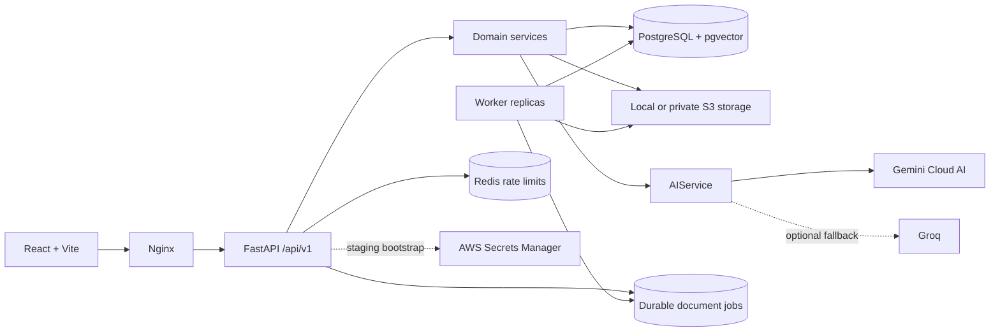

# Workflix


**Corporate Learning & Knowledge Platform**

Workflix is a portfolio-ready SaaS product that brings corporate training, internal knowledge,
assessments, learning paths, certificates, and management visibility into one secure experience.

> Release status: **PORTFOLIO RELEASE READY** — the product scope is complete and validated end to
> end for demonstration.

## The Problem

Companies keep training, procedures, videos, and internal documents across shared drives, email,
and disconnected tools. Employees struggle to find the current material, while managers cannot
reliably answer who received, started, completed, or acknowledged each requirement.

That fragmentation creates operational risk, repeated administrative work, and weak evidence for
mandatory learning.

## The Solution

Workflix provides a company-scoped learning hub where administrators publish and assign content,
employees continue from where they stopped, quizzes confirm understanding, ordered paths guide
development, and verifiable certificates prove completion. Analytics and CSV exports turn the same
source of truth into management visibility.

The product combines a premium content-discovery experience with explicit multi-tenant boundaries,
durable document processing, and human-reviewed cloud AI authoring.

## Features

- Responsive dark-mode experiences for `ADMIN` and `EMPLOYEE` profiles.
- Secure JWT authentication with rotating refresh tokens and Argon2 password hashing.
- Company-scoped users, trainings, assignments, progress, quizzes, attempts, and authorization.
- Article, video, and PDF training formats with draft and published states.
- Training creation, editing, assignment, search, progress, and server-corrected assessments.
- Ordered learning paths with required steps, sequential availability, and aggregate progress.
- Automatic certificates with immutable identity snapshots and public verification codes.
- Professional PDF certificate downloads generated with ReportLab.
- Management dashboards, analytics, overdue visibility, learning hours, and safe CSV exports.
- Private PDF versions, authorized downloads, extraction, selective OCR, acknowledgements, and
  document questions with page citations.
- Durable PostgreSQL worker queue with leases, retries, heartbeats, and dead-letter handling.
- Redis-backed staging rate limits, S3-compatible private object storage, and AWS Secrets Manager
  bootstrap.
- Idempotent, realistic NovaTech demo data for immediate product presentation.

## AI Features

- **Training generation:** Gemini creates a structured training draft from a topic, audience,
  objectives, and expected duration.
- **Quiz generation:** Gemini creates reviewable multiple-choice questions, explanations, correct
  options, and a passing score for an existing training.
- **Gemini integration:** the backend uses an injected REST transport and validates every generated
  payload with Pydantic before it reaches the editor.
- **Cloud AI architecture:** application workflows depend on `AIService`, not a vendor SDK. Gemini
  is primary, Groq is an optional authoring fallback adapter, and local model execution is disabled.
- **Human review:** AI output remains a draft and is never published automatically.

Tests use fake providers and do not consume Gemini quota. Live generation requires a locally
configured `GEMINI_API_KEY` with provider availability and quota.

## Tech Stack

| Area           | Technology                                                         |
| -------------- | ------------------------------------------------------------------ |
| Frontend       | React 19, Vite, TypeScript, React Router, TanStack Query           |
| API            | FastAPI, Python 3.13, Pydantic                                     |
| Persistence    | PostgreSQL 17, pgvector, SQLAlchemy 2, Alembic                     |
| AI & documents | Gemini, PyMuPDF, Tesseract OCR, ReportLab                          |
| Infrastructure | Docker Compose, Nginx, Redis, MinIO/S3, AWS Secrets Manager        |
| Quality        | Pytest, Ruff, Vitest, ESLint, Prettier, Playwright, GitHub Actions |

## Architecture



Workflix is a modular monolith with a separately scalable document worker. This keeps transactions
simple while isolating extraction, OCR, and indexing from HTTP replicas. See
[architecture.md](docs/architecture.md) and the [architecture decisions](docs/adr).

## Screenshots

| Employee experience                                       | Administration                                                 |
| --------------------------------------------------------- | -------------------------------------------------------------- |
|           |     |
|    |        |
|           |      |
|  |  |

## Demo

After startup:

- Web: [http://localhost:5173](http://localhost:5173)
- API documentation: [http://localhost:8000/docs](http://localhost:8000/docs)
- Liveness: [http://localhost:8000/health](http://localhost:8000/health)
- Readiness: [http://localhost:8000/ready](http://localhost:8000/ready)

The local-only NovaTech demo accounts share the password `Workflix@2026`:

| Profile       | Email                    |
| ------------- | ------------------------ |
| Administrator | `admin@workflix.demo`    |
| Employee      | `employee@workflix.demo` |

The idempotent seed includes five fictional employees, six published trainings, specific quizzes,
realistic progress, two learning paths, a certificate, and populated analytics.

## Running Locally

Prerequisite: Docker Desktop with Docker Compose.

```bash
cp .env.example .env
docker compose up --build
```

PowerShell:

```powershell
Copy-Item .env.example .env
docker compose up --build
```

The backend runs migrations, applies the demo seed, starts the API, and then allows the worker and
frontend health-gated startup. If port `5173` is already used:

```powershell
$env:FRONTEND_PORT = "5174"
docker compose up --build
```

For host-based development, Node.js 22+ and Python 3.13+ are required. Environment details and the
hardened staging overlay are documented in [docs/deployment.md](docs/deployment.md).

## Tests

Backend:

```bash
cd backend
ruff check .
ruff format --check .
pytest
```

Frontend:

```bash
npm run lint
npm exec --workspace frontend prettier -- --check .
npm run test
npm run build
```

End to end, with the Docker stack running:

```bash
npm run test:e2e
```

GitHub Actions enforces backend, frontend, Compose, migration-owned startup, and Playwright browser
journeys on every pull request and push to `main`.

## Security

- Tenant identity comes from the verified principal, never a client-provided company identifier.
- AI prompts, tokens, document bodies, and secrets are excluded from structured application logs.
- `.env` files are ignored; committed examples contain placeholders only.
- PDFs use private tenant-prefixed object keys and authorization-gated downloads.
- Staging supports Redis request limits, private S3-compatible storage, and an allowlisted AWS
  Secrets Manager payload.
- AI-generated content requires administrator review before persistence and publication.

See [docs/security.md](docs/security.md) for the complete baseline.

## Project Structure

```text
workflix/
├── frontend/
│   └── src/{app,components,features,hooks,pages,services,types,utils}
├── backend/
│   ├── app/{ai,api,core,db,models,rag,repositories,schemas,services,storage}
│   ├── migrations/
│   └── tests/
├── tests/e2e/
├── docker/
├── docs/
├── .github/workflows/
├── docker-compose.yml
├── docker-compose.staging.yml
├── PROJECT_STATUS.md
└── README.md
```

## Roadmap

The portfolio release is feature-complete. Future product directions, intentionally outside this
release, are limited to:

- enterprise SSO and directory synchronization;
- advanced notification and assignment automation;
- department/position governance and a dedicated manager profile;
- expanded audit reporting and production deployment options.

## License

Workflix is available under the [MIT License](LICENSE).
