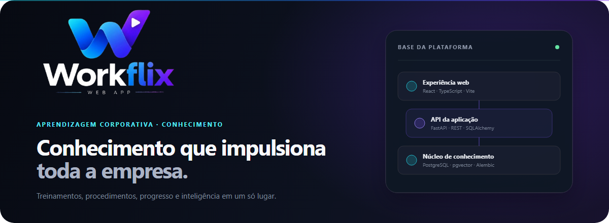
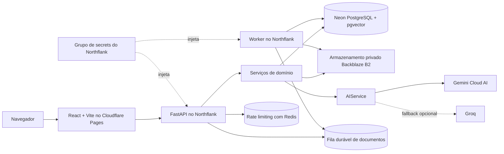
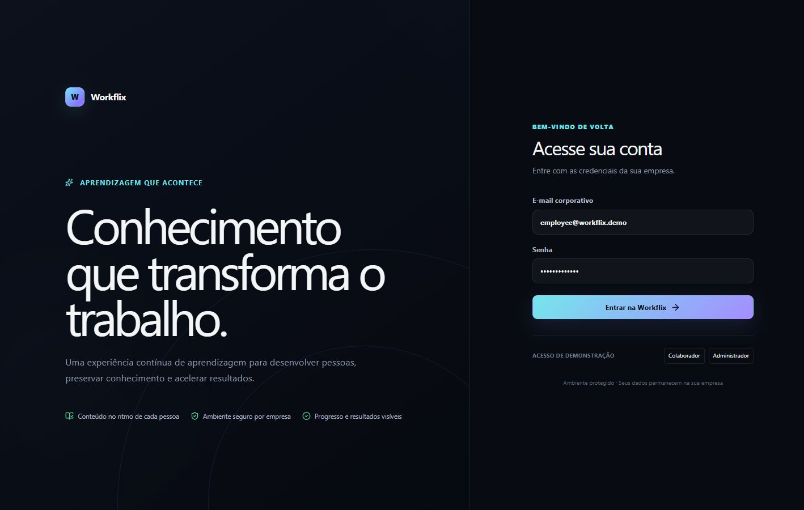
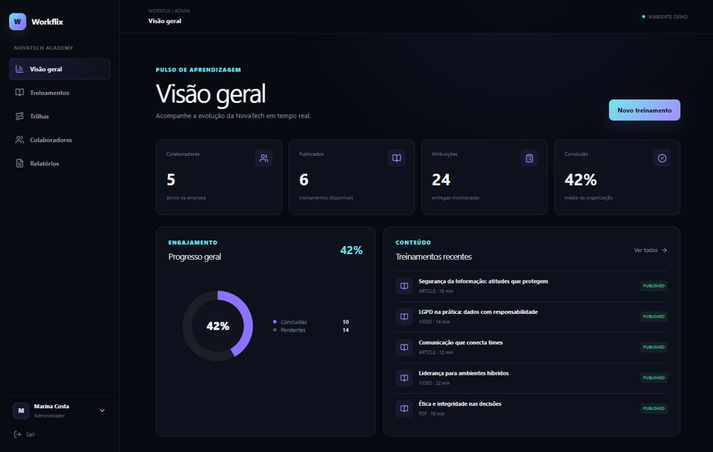
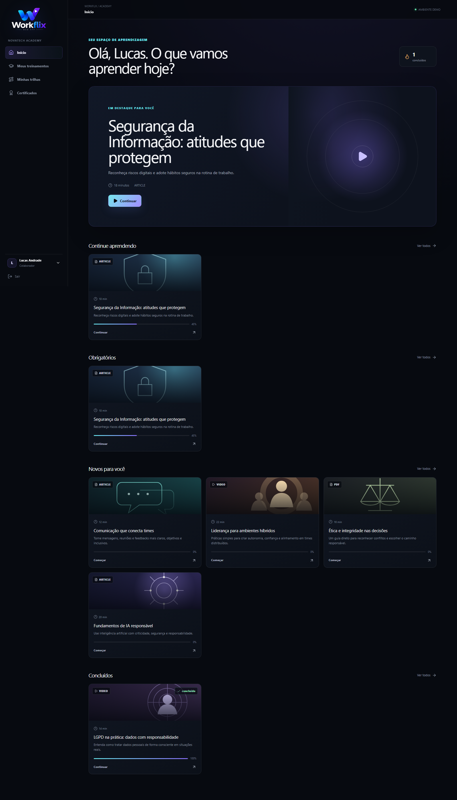
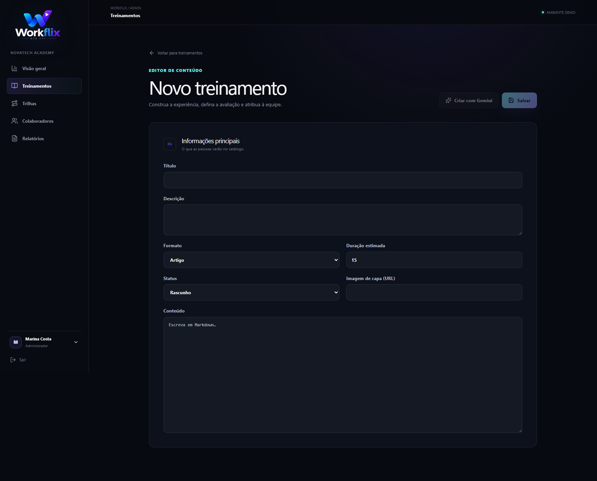
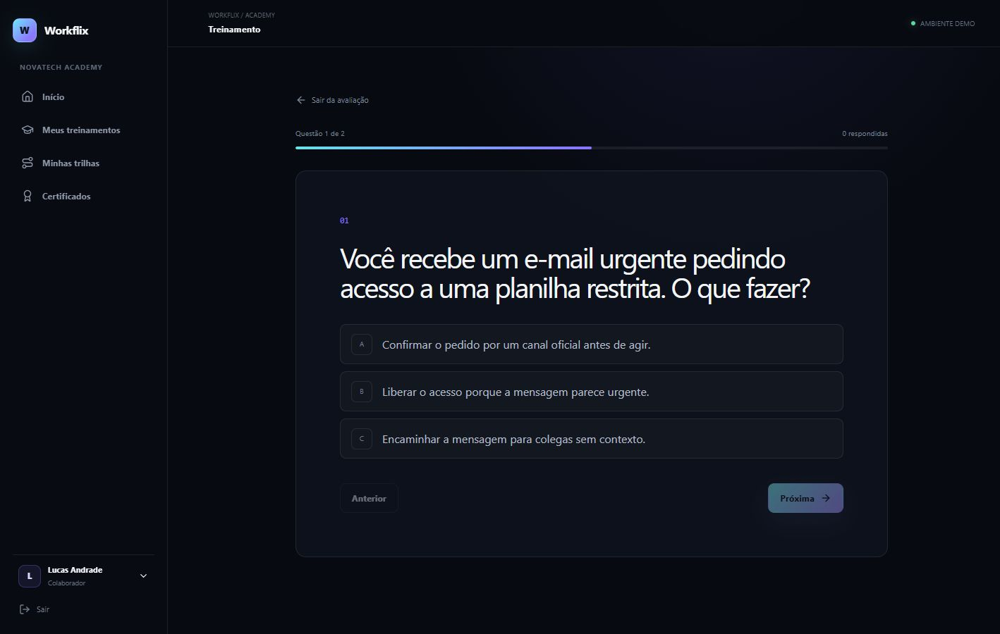
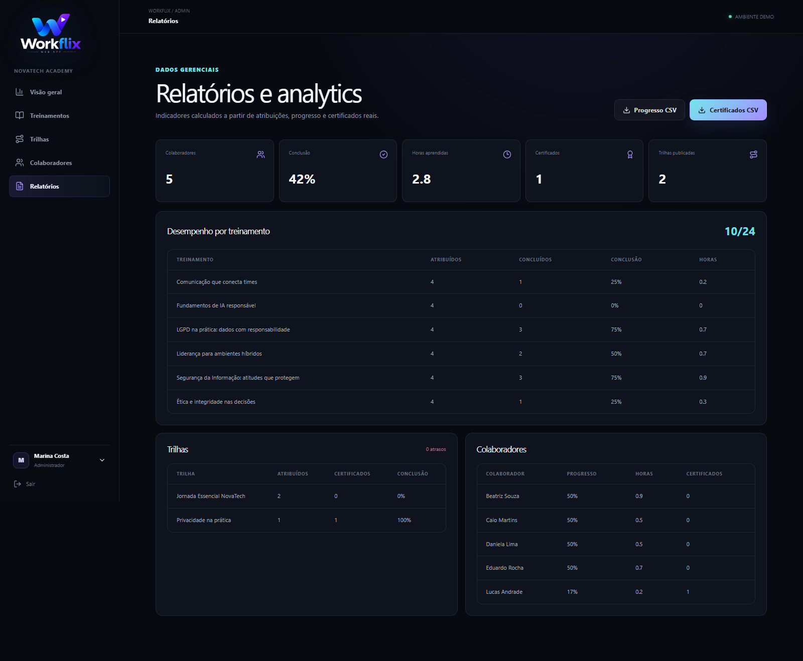
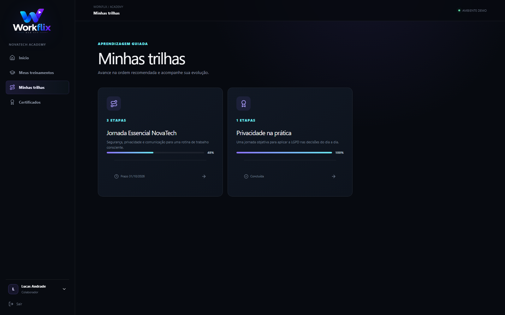
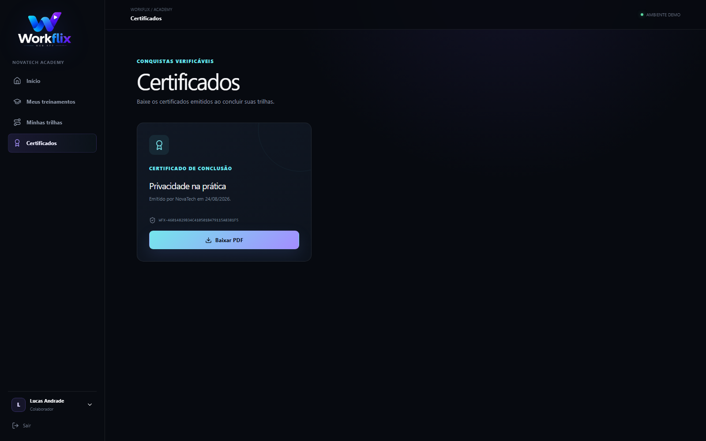

# Workflix



**Plataforma Corporativa de Aprendizagem e Conhecimento**

Workflix é um produto SaaS pronto para portfólio que reúne treinamentos corporativos, conhecimento
interno, avaliações, trilhas de aprendizagem, certificados e visibilidade gerencial em uma
experiência segura.

> Status da versão: **PORTFOLIO RELEASE READY** — o escopo do produto está concluído e validado de
> ponta a ponta para demonstrações.

Consulte o [status detalhado da versão](docs/project-status.md) e o
[histórico de alterações](docs/changelog.md).

## O Problema

Empresas mantêm treinamentos, procedimentos, vídeos e documentos internos espalhados entre
diretórios compartilhados, e-mails e ferramentas desconectadas. Colaboradores têm dificuldade para
encontrar o material atualizado, enquanto gestores não conseguem identificar com segurança quem
recebeu, iniciou, concluiu ou confirmou a leitura de cada conteúdo obrigatório.

Essa fragmentação gera riscos operacionais, trabalho administrativo repetitivo e evidências frágeis
sobre treinamentos obrigatórios.

## A Solução

Workflix oferece uma central de aprendizagem isolada por empresa, na qual administradores publicam
e atribuem conteúdos, colaboradores continuam de onde pararam, quizzes confirmam o entendimento,
trilhas ordenadas orientam o desenvolvimento e certificados verificáveis comprovam a conclusão.
Analytics e exportações CSV transformam a mesma fonte de dados em visibilidade gerencial.

O produto combina uma experiência premium de descoberta de conteúdo com isolamento multi-tenant
explícito, processamento durável de documentos e criação de conteúdo por IA em nuvem com revisão
humana.

## Funcionalidades

- Experiências responsivas em modo escuro para os perfis `ADMIN` e `EMPLOYEE`.
- Autenticação JWT segura, refresh tokens rotativos e hash de senhas com Argon2.
- Usuários, treinamentos, atribuições, progresso, quizzes, tentativas e autorizações isolados por
  empresa.
- Treinamentos nos formatos artigo, vídeo e PDF, com estados de rascunho e publicado.
- Criação, edição, atribuição, busca e acompanhamento de treinamentos, com avaliações corrigidas
  pelo servidor.
- Trilhas de aprendizagem ordenadas, com etapas obrigatórias, liberação sequencial e progresso
  consolidado.
- Certificados automáticos com dados de identidade imutáveis e códigos públicos de verificação.
- Download de certificados profissionais em PDF gerados com ReportLab.
- Dashboards gerenciais, analytics, acompanhamento de atrasos, horas de aprendizagem e exportações
  CSV seguras.
- Versionamento privado de PDFs, downloads autorizados, extração, OCR seletivo, registros de ciência
  e perguntas sobre documentos com citações de página.
- Fila durável de workers em PostgreSQL com leases, tentativas, heartbeats e tratamento de dead
  letters.
- Rate limiting com Redis, armazenamento privado compatível com S3 e secrets isolados por ambiente,
  com suporte opcional a bootstrap pelo AWS Secrets Manager.
- Dados demo realistas e idempotentes da empresa fictícia NovaTech para apresentação imediata.

## Recursos de IA

- **Geração de treinamento:** o Gemini cria um rascunho estruturado a partir de tema, público,
  objetivos e duração esperada.
- **Geração de quiz:** o Gemini cria questões de múltipla escolha revisáveis, explicações, opções
  corretas e nota mínima para um treinamento existente.
- **Integração Gemini:** o backend usa um transporte REST injetável e valida cada payload gerado com
  Pydantic antes de enviá-lo ao editor.
- **Arquitetura de IA em nuvem:** os fluxos da aplicação dependem de `AIService`, não de um SDK de
  fornecedor. Gemini é o provedor principal, Groq é um adaptador opcional de fallback e a execução
  de modelos locais permanece desativada.
- **Revisão humana:** o conteúdo gerado por IA permanece como rascunho e nunca é publicado
  automaticamente.

Os testes usam provedores simulados e não consomem a cota do Gemini. No ambiente de portfólio, a
credencial é injetada pelo grupo de secrets da plataforma de hospedagem; a geração local exige uma
`GEMINI_API_KEY` privada, disponibilidade do provedor e cota.

## Tecnologias

| Área               | Tecnologia                                                         |
| ------------------ | ------------------------------------------------------------------ |
| Frontend           | React 19, Vite, TypeScript, React Router, TanStack Query           |
| API                | FastAPI, Python 3.13, Pydantic                                     |
| Persistência       | PostgreSQL 17, pgvector, SQLAlchemy 2, Alembic                     |
| IA e documentos    | Gemini, PyMuPDF, Tesseract OCR, ReportLab                          |
| Infraestrutura     | Docker, Cloudflare Pages, Northflank, Neon, Redis, Backblaze B2/S3 |
| Qualidade e testes | Pytest, Ruff, Vitest, ESLint, Prettier, Playwright, GitHub Actions |

## Arquitetura



Workflix é um monólito modular com um worker de documentos escalável separadamente. Essa abordagem
mantém as transações simples enquanto isola extração, OCR e indexação das réplicas HTTP. Consulte
[architecture.md](docs/architecture.md) e as [decisões de arquitetura](docs/adr).

## Capturas de Tela

| Experiência do colaborador                                         | Administração                                                        |
| ------------------------------------------------------------------ | -------------------------------------------------------------------- |
|                 |  |
|       |    |
|                |            |
|  |    |

## Demonstração

O ambiente público de portfólio está disponível em:

- Aplicação web: [workflix.pages.dev](https://workflix.pages.dev)
- Documentação da API: [Swagger UI do FastAPI](https://p01--backend--5ljdt6tvrrkz.code.run/docs)
- Liveness: [health do backend](https://p01--backend--5ljdt6tvrrkz.code.run/health)
- Readiness: [readiness do backend](https://p01--backend--5ljdt6tvrrkz.code.run/ready)

As contas demo da empresa fictícia NovaTech compartilham a senha `Workflix@2026`:

| Perfil        | E-mail                   |
| ------------- | ------------------------ |
| Administrador | `admin@workflix.demo`    |
| Colaborador   | `employee@workflix.demo` |

O seed idempotente inclui cinco colaboradores fictícios, seis treinamentos publicados, quizzes
específicos, progresso realista, duas trilhas de aprendizagem, certificados de treinamentos e
trilhas, além de analytics
preenchidos. Essas credenciais existem apenas para a demonstração pública de portfólio e nunca
devem ser reutilizadas.

## Executando Localmente

Pré-requisito: Docker Desktop com Docker Compose.

```bash
cp .env.example .env
docker compose up --build
```

PowerShell:

```powershell
Copy-Item .env.example .env
docker compose up --build
```

O backend executa as migrations, aplica o seed demo e inicia a API. Em seguida, o worker e o
frontend iniciam condicionados aos health checks. Caso a porta `5173` já esteja em uso:

```powershell
$env:FRONTEND_PORT = "5174"
docker compose up --build
```

Para desenvolvimento diretamente na máquina, são necessários Node.js 22+ e Python 3.13+. Os
detalhes das variáveis de ambiente e do overlay de staging com hardening estão documentados em
[docs/deployment.md](docs/deployment.md).

## Testes

Backend:

```bash
cd backend
ruff check .
ruff format --check .
pytest
```

Frontend:

```bash
npm run lint
npm exec --workspace frontend prettier -- --check .
npm run test
npm run build
```

Testes de ponta a ponta com a stack Docker em execução:

```bash
npm run test:e2e
```

Contra o ambiente público de portfólio:

```powershell
$env:PLAYWRIGHT_BASE_URL = "https://workflix.pages.dev"
$env:PLAYWRIGHT_API_BASE_URL = "https://p01--backend--5ljdt6tvrrkz.code.run/api/v1"
npm run test:e2e
```

O GitHub Actions valida backend, frontend, Compose, inicialização controlada pelas migrations e
jornadas Playwright em cada pull request e push para a branch `main`.

## Segurança

- A identidade do tenant vem do usuário autenticado, nunca de um identificador de empresa enviado
  pelo cliente.
- Prompts de IA, tokens, conteúdo de documentos e secrets são excluídos dos logs estruturados da
  aplicação.
- Arquivos `.env` são ignorados; os exemplos versionados contêm apenas placeholders.
- PDFs usam chaves de objetos privadas com prefixo por tenant e downloads protegidos por
  autorização.
- O ambiente de portfólio usa rate limiting com Redis, armazenamento privado Backblaze B2 e um
  grupo de secrets do Northflank; o bootstrap com payload autorizado do AWS Secrets Manager
  continua disponível.
- Conteúdos gerados por IA exigem revisão do administrador antes de serem persistidos e publicados.

Consulte [docs/security.md](docs/security.md) para conhecer a baseline completa.

## Estrutura do Projeto

```text
workflix/
├── frontend/
│   └── src/{app,components,features,pages,services,styles,types}
├── backend/
│   ├── app/{ai,api,core,db,models,rag,repositories,schemas,services,storage}
│   ├── migrations/
│   └── tests/
├── tests/e2e/
├── docker/{compose.staging.yml,staging.env.example}
├── docs/{adr,assets,screenshots,changelog.md,project-status.md}
├── .github/workflows/
├── docker-compose.yml
├── package.json
├── LICENSE
└── README.md
```

## Roadmap

A versão de portfólio está funcionalmente concluída. As direções futuras do produto,
intencionalmente fora desta versão, estão limitadas a:

- SSO corporativo e sincronização de diretórios;
- políticas avançadas de notificações e automação de atribuições;
- governança por departamento e cargo, com perfil dedicado de gestor;
- relatórios de auditoria ampliados e novas opções de observabilidade em produção.

## Licença

Workflix está disponível sob a [Licença MIT](LICENSE).
