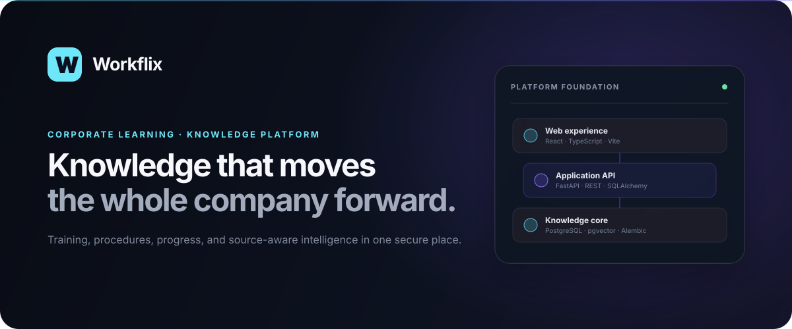
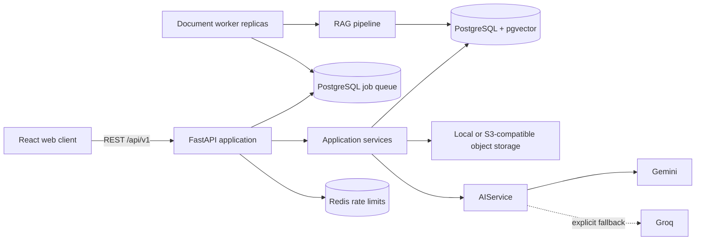

# Workflix



Workflix is a multi-tenant corporate learning and knowledge platform designed to centralize training, procedures, documents, assessments, and evidence of progress in one measurable experience.

> Project status: the focused Workflix MVP and the first document-intelligence phase run end to end with authentication, tenant isolation, immutable PDF versions, page extraction, pgvector retrieval, cited answers, quizzes, and Gemini-assisted authoring.

## Overview

Companies often distribute important knowledge across shared drives, email threads, video links, PDFs, and internal folders. That fragmentation makes simple operational questions surprisingly hard: Who completed mandatory training? Which procedure is current? Who still needs to acknowledge a policy? What content applies to a role?

Workflix treats those questions as a product and architecture problem, not as a generic CRUD exercise. The platform combines a polished discovery experience with tenant-safe workflows, durable completion evidence, document intelligence, and operational observability.

## Problem

Fragmented corporate knowledge creates concrete risk:

- employees cannot reliably find the current procedure;
- managers lack completion and expiration visibility;
- administrators repeat manual assignment and reporting work;
- companies cannot prove that a person completed or acknowledged required material;
- AI over private documents can cross security boundaries when tenancy is added as an afterthought.

## Solution

Workflix provides one company-scoped catalog for learning and knowledge, backed by explicit assignments, progress, assessments, document versions, and audit events. Its architecture starts multi-tenant, migration-owned, API-first, and provider-neutral so later AI features do not compromise the core security model.

## Features

### Available in the MVP

- Premium responsive React/Vite experience for ADMIN and EMPLOYEE profiles.
- JWT login, short-lived access tokens, rotating opaque refresh tokens, logout, and Argon2 passwords.
- Company-scoped users, trainings, assignments, progress, quizzes, and attempts.
- ARTICLE, VIDEO, and PDF training formats with draft/published workflow.
- Authorized PDF upload/download with MIME, signature, and size validation.
- Provider-neutral local/S3-compatible PDF storage with private tenant-scoped object keys.
- Immutable PDF versions with checksums, page extraction, observable processing states, and ADMIN reprocessing.
- Durable PostgreSQL document jobs with leased multi-worker claims, heartbeats, exponential retry, and dead-letter state.
- Gemini cloud embeddings, 768-dimensional pgvector chunks, cosine retrieval, and HNSW indexing.
- Employee questions over assigned PDFs with grounded answers and explicit document/page citations.
- Employee home, catalog, player, assessment, correction, and result experiences.
- Admin dashboard, training/quiz editor, assignment workflow, and employee management.
- Gemini structured generation for reviewable training and quiz drafts.
- Idempotent NovaTech demo seed with six local SVG training covers.
- FastAPI application factory with versioned routes and OpenAPI documentation.
- Stable error envelopes and correlation IDs returned as `X-Request-ID`.
- Structured JSON logs without prompts, tokens, secrets, or document bodies.
- Redis-backed rate limits for authentication and AI generation, with a memory adapter for local use.
- Optional AWS Secrets Manager bootstrap with an explicit secret-key allowlist.
- Liveness and dependency-aware readiness endpoints.
- SQLAlchemy 2.x asynchronous infrastructure and Alembic-only schema evolution.
- PostgreSQL 17 with pgvector and health-gated container startup.
- Multi-stage, health-checked Docker images and separate API/worker runtime services.
- Backend/frontend quality gates and Playwright browser journeys against Docker in GitHub Actions.

### Intentionally deferred

- OCR for image-only PDFs and document acknowledgment evidence.
- Learning paths, certificates, notifications, reports, and audit history.
- Departments, positions, manager role, SSO, billing, and enterprise integrations.

## AI Features

The AI layer is designed around cloud providers only. Gemini is primary and Groq is an optional fallback; provider and model selection are environment-driven. Domain workflows talk to `AIService`, never directly to a vendor SDK.

The MVP includes:

- `AIProvider` contracts for text, structured output, and streaming;
- provider registry, injected transport boundary, and a real Gemini REST transport;
- explicit fallback state instead of silent provider switching;
- Pydantic validation for persistable structured output;
- a deliberately disabled Ollama adapter that enforces the no-local-model policy;
- ADMIN-only `/api/v1/ai/generate-training` and `/api/v1/ai/generate-quiz` endpoints;
- Pydantic/JSON Schema validation before generated content reaches the editor.

Tests inject fake providers and never spend a real Gemini request. `GEMINI_API_KEY` remains optional: PDF extraction finishes in `EXTRACTED` without it, while authoring and RAG return explicit configuration errors. When configured, `gemini-embedding-2` creates 768-dimensional document/query embeddings and the employee player exposes source-aware questions over the latest authorized `READY` version. Groq remains an architectural adapter/fallback seam for authoring, not a live embedding transport.

PDF processing states are `UPLOADED`, `EXTRACTING`, `EXTRACTED`, `INDEXING`, `READY`, and `FAILED`. Upload creates the version and its durable PostgreSQL job atomically. Independent workers claim jobs with `FOR UPDATE SKIP LOCKED`, renew bounded leases, retry transient storage/embedding failures with exponential backoff, and move permanent or exhausted failures to `DEAD_LETTER`. Processing remains idempotent and the ADMIN retry endpoint safely requeues completed or dead-lettered versions.

## Architecture



Workflix begins as a modular monolith with a separately scalable document-worker process. This keeps domain transactions simple while isolating workload-heavy extraction and indexing from HTTP replicas. Read the [architecture guide](docs/architecture.md) and [ADRs](docs/adr) for the reasoning behind each choice.

## Tech Stack

| Layer       | Technology                                                          |
| ----------- | ------------------------------------------------------------------- |
| Web         | React 19, Vite, TypeScript, React Router, TanStack Query            |
| UI          | Tailwind CSS, Lucide React, Framer Motion                           |
| Forms       | React Hook Form, Zod                                                |
| API         | Python 3.13, FastAPI, Pydantic Settings                             |
| Persistence | SQLAlchemy 2.x, Alembic, psycopg                                    |
| Data        | PostgreSQL 17, pgvector                                             |
| Quality     | Ruff, pytest, ESLint, Prettier, Vitest, Testing Library, Playwright |
| Delivery    | Docker Compose, Nginx, Redis, MinIO, GitHub Actions                 |

## Product experience

The production frontend includes a split-screen login, personalized employee discovery, authenticated learning player, multi-step quiz/result flow, admin analytics, training and quiz authoring, assignments, and people progress. Playwright continuously checks the employee, ADMIN, and 390×844 mobile journeys.

## Demo

After startup (default port):

- Web: [http://localhost:5173](http://localhost:5173)
- API docs: [http://localhost:8000/docs](http://localhost:8000/docs)
- Liveness: [http://localhost:8000/health](http://localhost:8000/health)
- Readiness: [http://localhost:8000/ready](http://localhost:8000/ready)

NovaTech demo accounts use the same local-only password `Workflix@2026`:

| Profile       | Email                    |
| ------------- | ------------------------ |
| Administrator | `admin@workflix.demo`    |
| Employee      | `employee@workflix.demo` |

Five fictional employees, six published trainings, assignments, progress, and quizzes are seeded automatically when `DEMO_MODE=true`. The seed is idempotent.

## Getting Started

### Prerequisites

- Docker Desktop with Docker Compose
- Optional local development: Node.js 22+ and Python 3.13+

### Run the complete stack

```bash
cp .env.example .env
docker compose up --build
```

The backend waits for PostgreSQL, runs `alembic upgrade head`, applies the idempotent demo seed, and then starts FastAPI. The document worker starts after the backend is healthy and consumes durable jobs from PostgreSQL. The frontend waits for a healthy backend before starting Nginx.

If port `5173` is already in use, choose another host port without editing Compose:

```bash
FRONTEND_PORT=5174 docker compose up --build
```

On PowerShell:

```powershell
$env:FRONTEND_PORT = "5174"
docker compose up --build
```

### Run the frontend locally

```bash
npm install
npm run dev
```

Vite proxies `/api` requests to `http://localhost:8000`.

### Run the hardened staging topology

Copy `docker/staging.env.example` to the ignored `docker/staging.env`, replace every placeholder, and make the AWS secret available to the workload identity:

```bash
docker compose --env-file docker/staging.env \
  -f docker-compose.yml \
  -f docker-compose.staging.yml \
  up --build -d
```

The overlay adds Redis, a private S3-compatible MinIO bucket, distributed request limits, and AWS Secrets Manager bootstrap. It defaults to `SECRETS_MANAGER_PROVIDER=aws`; use `env` only for an explicit portable smoke test. See [the deployment guide](docs/deployment.md) for the secret JSON contract and production notes.

### Run the backend locally

Create `./.env` from `.env.example`, change the database hostname from `postgres` to `localhost`, then:

```bash
cd backend
python -m venv .venv
source .venv/bin/activate
pip install -e ".[dev]"
alembic upgrade head
uvicorn app.main:app --reload
```

On Windows, activate with `.venv\Scripts\Activate.ps1`.

## Environment Variables

`.env.example` is the complete development contract. Important groups include:

- application: `APP_ENV`, `APP_VERSION`, `DEMO_MODE`, `LOG_LEVEL`;
- data: `DATABASE_URL`, `POSTGRES_DB`, `POSTGRES_USER`, `POSTGRES_PASSWORD`;
- authentication: `JWT_SECRET`, access lifetime, and refresh lifetime;
- AI/RAG: primary/fallback provider, Gemini/Groq keys, generation and embedding models, embedding dimensions, page cap, retrieval limit, worker polling, leases, heartbeats, attempts, and retry backoff;
- files: local/S3 provider, bucket, endpoint, credentials, path style, encryption, and upload limit;
- request protection: Redis URL and limits for login, refresh, and AI generation;
- managed secrets: provider, secret identifier, region, and optional endpoint;
- web: CORS origins, API base URL, and optional frontend host port.

Never commit `.env` or use the included local credentials outside a development machine.

## Database

The first migration enables `vector` and `pgcrypto`; the second owns the focused MVP schema; `20260821_0003` adds document intelligence; and `20260821_0004` adds the durable processing queue. Production startup never calls `create_all()`.

The initial relational model, ownership rules, and relationship diagram live in [docs/database.md](docs/database.md).

Useful migration commands:

```bash
cd backend
alembic current
alembic upgrade head
alembic history
```

## API Documentation

FastAPI publishes interactive Swagger UI at `/docs`, ReDoc at `/redoc`, and the OpenAPI document at `/openapi.json`.

Operational endpoints are stable at the root; product endpoints are versioned under `/api/v1`. Errors use this envelope:

```json
{
  "error": {
    "code": "CONTENT_NOT_FOUND",
    "message": "Content not found",
    "request_id": "correlation-id"
  }
}
```

## Testing

Backend:

```bash
cd backend
ruff check .
ruff format --check .
pytest
```

Frontend:

```bash
npm run lint
npm exec --workspace frontend prettier -- --check .
npm run test
npm run build
```

Browser journeys (requires the Docker stack):

```bash
npx playwright install chromium
npm run test:e2e
```

The backend suite covers auth rotation/logout, RBAC, tenant isolation, training visibility, progress, real PDF extraction/versioning, page/chunk persistence, cited RAG answers, prompt-injection boundaries, quizzes, AI mocks, rate limiting, managed secrets, object storage, and seed idempotency. Playwright executes login, learning, quiz/result, ADMIN, and mobile-overflow flows against the Docker/PostgreSQL stack in CI.

## Security

- Configuration is validated at startup; required secrets cannot be omitted silently.
- CORS is an explicit allowlist.
- Request IDs are sanitized before reuse.
- Production error bodies never include Python tracebacks.
- Logs exclude secrets and private content by design.
- Tenant context comes from the verified principal, never from a client-selected `company_id`.
- Semantic retrieval contracts require both company and user context before ranking.
- AI-generated business content is reviewable and never auto-published.
- Authentication and AI abuse controls use atomic Redis windows in staging.
- Staging secrets are loaded from an allowlisted AWS Secrets Manager JSON payload.
- PDFs use private, tenant-prefixed S3-compatible objects and are returned only after authorization.
- Vector retrieval derives company and principal from the verified user, applies assignment/publish filters before ranking, and only searches the latest `READY` document version.
- Document text is explicitly treated as untrusted evidence; commands found inside a PDF never become system instructions.

See [docs/security.md](docs/security.md) for the complete baseline and planned controls.

## Project Structure

```text
workflix/
├── frontend/
│   ├── src/
│   │   ├── app/
│   │   ├── components/
│   │   ├── features/
│   │   ├── hooks/
│   │   ├── pages/
│   │   ├── services/
│   │   ├── types/
│   │   └── utils/
│   ├── Dockerfile
│   └── nginx.conf
├── backend/
│   ├── app/
│   │   ├── ai/
│   │   │   ├── providers/
│   │   │   │   ├── gemini.py
│   │   │   │   ├── groq.py
│   │   │   │   └── ollama.py
│   │   │   ├── base.py
│   │   │   ├── registry.py
│   │   │   └── service.py
│   │   ├── api/
│   │   ├── core/
│   │   ├── db/
│   │   ├── models/
│   │   ├── rag/
│   │   │   ├── chunker.py
│   │   │   ├── document_processor.py
│   │   │   ├── embeddings.py
│   │   │   ├── extractor.py
│   │   │   ├── jobs.py
│   │   │   ├── queue.py
│   │   │   ├── providers/gemini.py
│   │   │   └── retriever.py
│   │   ├── worker.py
│   │   ├── repositories/
│   │   ├── schemas/
│   │   ├── storage/
│   │   └── services/
│   ├── migrations/
│   ├── tests/
│   └── Dockerfile
├── tests/e2e/
├── docker/
├── docs/
│   └── adr/
├── .github/workflows/
├── docker-compose.yml
├── docker-compose.staging.yml
├── playwright.config.ts
├── PROJECT_STATUS.md
└── README.md
```

## Roadmap

### Focused MVP — complete

- Authentication, companies, users, refresh-token rotation, RBAC, and tenant isolation.
- Content catalog, publishing, assignment, progress, and employee discovery.
- Backend-corrected quizzes and basic dashboards.
- Cloud Gemini training/quiz generation with human review and validated structured output.

### Document intelligence V1 — complete

- Immutable PDF versions, page extraction, embeddings, pgvector retrieval, and cited answers.

### V2

- OCR and acknowledgment evidence.
- Learning paths, certificates, manager analytics, and richer reports.

### V3

- Enterprise integrations, advanced notifications, billing, mobile refinements, and deployment options.

Progress, decisions, known issues, and the next concrete phase are kept current in [PROJECT_STATUS.md](PROJECT_STATUS.md).

## License

Workflix is available under the [MIT License](LICENSE).
