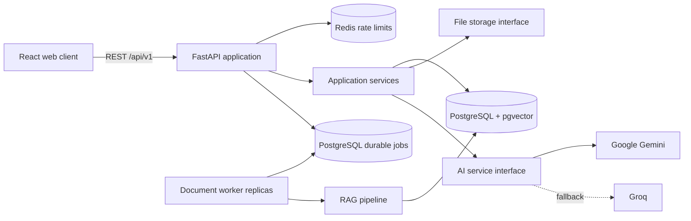

# Architecture

## Context

Workflix centralizes corporate training, procedures, documents, assessments, and evidence of completion. It must be credible as a product while remaining inexpensive and understandable for a small engineering team.

## System shape

Workflix starts as a modular monolith with independently built frontend and backend applications. Domain boundaries live in code rather than network hops. This keeps transactions, local development, and deployment straightforward while preserving a path to extract workload-heavy modules later.

## Backend boundaries

- `api`: HTTP transport, validation, dependency injection, and authorization entry points.
- `core`: configuration, logging, errors, security primitives, and middleware.
- `db`: SQLAlchemy session ownership, declarative models, and migration integration.
- `domains`: business capabilities organized by feature as they are implemented.
- `ai`: provider-neutral generation, structured output, fallback, and usage observation.
- `rag`: extraction, chunking, embedding, indexing, retrieval, and grounded answer orchestration.
- `storage`: provider-neutral document persistence.
- `services/learning_paths`, `services/certificates`, and `services/reports`: ordered learning workflows, immutable completion evidence/PDF rendering, and read-only management projections.

Routers do not contain persistence or business rules. Application services coordinate domain rules and transactions. Repositories encapsulate reusable persistence queries where they improve clarity.

## Frontend boundaries

- `app`: providers, routing, and application bootstrap.
- `components`: reusable interface primitives and cross-domain components.
- `features`: domain-oriented queries, mutations, schemas, and views.
- `pages`: route-level composition.
- `services`: typed HTTP infrastructure.
- `styles`: design tokens and global styles.

TanStack Query owns server state. Local component state owns transient interaction state. Global client state is introduced only for truly cross-cutting concerns such as the authenticated session.

## Cross-cutting guarantees

- API paths are versioned under `/api/v1`; operational `/health` and `/ready` probes remain stable.
- Every request receives or reuses a safe correlation ID and returns it as `X-Request-ID`.
- Errors follow a stable envelope and never expose production tracebacks.
- Structured logs include the correlation ID and exclude secrets and document bodies.
- Tenant context comes from the authenticated principal, not request payloads.
- Database evolution is migration-only.

## Deployment path

The local topology separates the static frontend, FastAPI API, document worker, and PostgreSQL/pgvector. The staging overlay adds Redis and private S3-compatible MinIO storage, while AWS Secrets Manager is read before configuration validation. PDF uploads atomically persist an immutable version and a durable job. Any worker replica may claim it through PostgreSQL row locking and a renewable lease, then execute object read → native PyMuPDF extraction → selective Tesseract OCR → page-aware chunks → Gemini embeddings → pgvector rows. Transient failures use bounded exponential retry; permanent and exhausted failures enter a dead-letter state that an ADMIN can explicitly requeue.

Employee acknowledgements are synchronous domain transactions, not worker jobs. The service authorizes the current assignment, locks and verifies the latest document version, and inserts an idempotent evidence snapshot. A newer version never mutates earlier evidence; it creates a new pending acknowledgement state.

Learning-path assignment is also synchronous: it creates the path assignment and any missing underlying training assignments in one transaction. Progress completion and passing quizzes flush their progress change before evaluating eligible published paths. The database uniqueness rule on employee/path makes certificate issuance idempotent, while the certificate snapshots names, workload, issue time, and verification code. PDF rendering is stateless and happens only after tenant/principal authorization.
