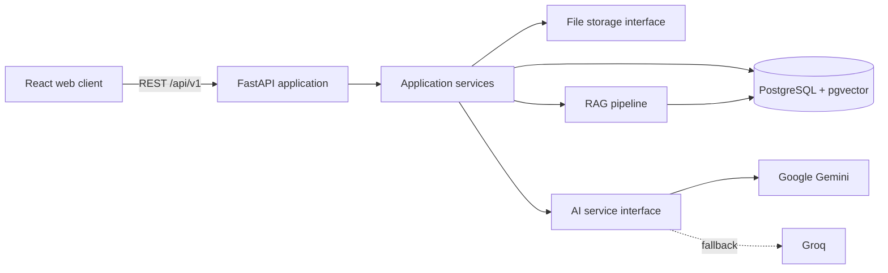

# Architecture

## Context

Workflix centralizes corporate training, procedures, documents, assessments, and evidence of completion. It must be credible as a product while remaining inexpensive and understandable for a small engineering team.

## System shape

Workflix starts as a modular monolith with independently built frontend and backend applications. Domain boundaries live in code rather than network hops. This keeps transactions, local development, and deployment straightforward while preserving a path to extract workload-heavy modules later.

## Backend boundaries

- `api`: HTTP transport, validation, dependency injection, and authorization entry points.
- `core`: configuration, logging, errors, security primitives, and middleware.
- `db`: SQLAlchemy session ownership, declarative models, and migration integration.
- `domains`: business capabilities organized by feature as they are implemented.
- `ai`: provider-neutral generation, structured output, fallback, and usage observation.
- `rag`: extraction, chunking, embedding, indexing, retrieval, and grounded answer orchestration.
- `storage`: provider-neutral document persistence.

Routers do not contain persistence or business rules. Application services coordinate domain rules and transactions. Repositories encapsulate reusable persistence queries where they improve clarity.

## Frontend boundaries

- `app`: providers, routing, and application bootstrap.
- `components`: reusable interface primitives and cross-domain components.
- `features`: domain-oriented queries, mutations, schemas, and views.
- `pages`: route-level composition.
- `services`: typed HTTP infrastructure.
- `styles`: design tokens and global styles.

TanStack Query owns server state. Local component state owns transient interaction state. Global client state is introduced only for truly cross-cutting concerns such as the authenticated session.

## Cross-cutting guarantees

- API paths are versioned under `/api/v1`; operational `/health` and `/ready` probes remain stable.
- Every request receives or reuses a safe correlation ID and returns it as `X-Request-ID`.
- Errors follow a stable envelope and never expose production tracebacks.
- Structured logs include the correlation ID and exclude secrets and document bodies.
- Tenant context comes from the authenticated principal, not request payloads.
- Database evolution is migration-only.

## Deployment path

The local and portfolio deployment topology uses three containers: static frontend, FastAPI backend, and PostgreSQL with pgvector. Background document processing begins behind an application interface and can move to a dedicated worker/queue when workload requires it.

