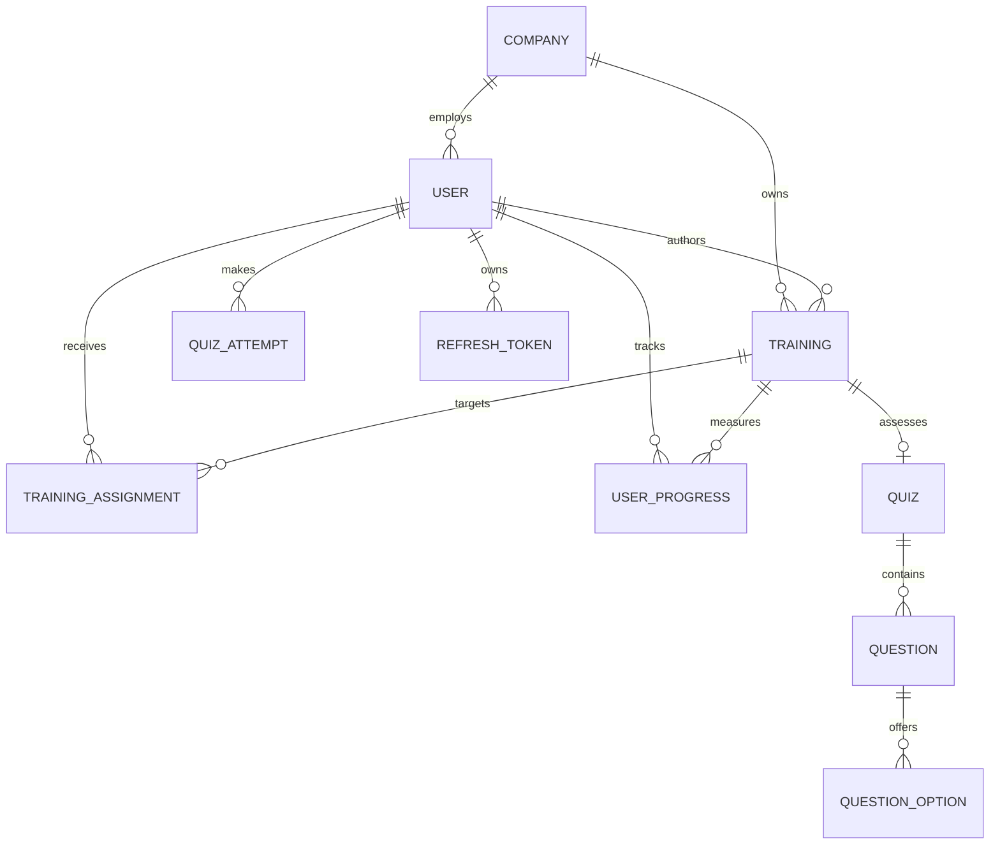

# Focused MVP Data Model

## Tenant boundary

`companies` is the ownership root. All company-scoped aggregates include a non-null `company_id`, and all uniqueness rules that describe company data include that key. Backend queries derive it from the authenticated user. Platform-only data is explicitly documented instead of silently omitting the tenant key.

## Relationship map

## Core entities

### Identity and organization

- `companies`: tenant identity, status, locale, timezone, and feature configuration.
- `users`: company membership, secure password hash, active state, and `ADMIN` or `EMPLOYEE` role.
- `refresh_tokens`: only hashed opaque refresh tokens, expiry, and revocation timestamps.

### Learning catalog

- `trainings`: `ARTICLE`, `VIDEO`, or `PDF` content with `DRAFT`/`PUBLISHED` lifecycle.
- `training_assignments`: employee targeting with optional due date and a uniqueness constraint per employee/training.
- `user_progress`: per-user percentage and started/completed timestamps.

### Assessment and proof

- `quizzes`, `questions`, and `question_options`: server-owned assessment definitions.
- `quiz_attempts`: immutable aggregate score evidence. Correct answers remain server-owned.

Document versions, embeddings, RAG records, learning paths, certificates, notifications, and audit tables remain V2 scope. The source modules for the future RAG boundary are preserved but do not own database tables in this MVP.

## Integrity strategy

- Use UUID primary keys and timezone-aware timestamps.
- Prefer explicit foreign keys and database constraints for invariants.
- Use soft lifecycle states where history matters; do not silently overwrite evidence.
- Index tenant keys with common filter/sort columns.
- Store refresh tokens only as hashes.
- Use a vector index only after corpus size and query plans justify its parameters.

Migration `20260821_0001` enables PostgreSQL extensions. Migration `20260821_0002` creates the complete focused MVP schema.
