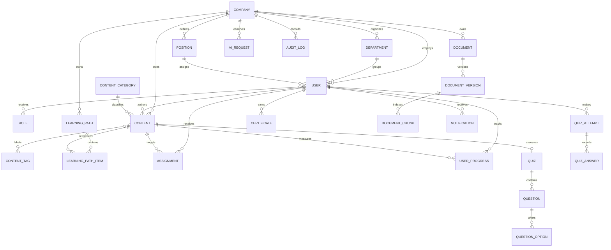

# Initial Data Model

## Tenant boundary

`companies` is the ownership root. All company-scoped aggregates include a non-null `company_id`, and all uniqueness rules that describe company data include that key. Backend queries derive it from the authenticated user. Platform-only data is explicitly documented instead of silently omitting the tenant key.

## Relationship map

## Core entities

### Identity and organization

- `companies`: tenant identity, status, locale, timezone, and feature configuration.
- `users`: company membership, verified identity, secure password hash, status, department, and position.
- `roles` and `user_roles`: scoped authorization. Initial role codes are `SUPER_ADMIN`, `ADMIN`, `MANAGER`, `INSTRUCTOR`, and `EMPLOYEE`.
- `departments` and `positions`: company-defined organizational structure.

### Learning catalog

- `contents`: versioned catalog metadata and lifecycle (`DRAFT`, `PUBLISHED`, `ARCHIVED`) for video, document, article, course, and procedure content.
- `content_categories`, `content_tags`, and join tables: tenant-scoped discovery metadata.
- `learning_paths` and `learning_path_items`: ordered curricula with prerequisites and mandatory steps.
- `assignments`: user, department, or position targeting with due dates and mandatory status.
- `user_progress`: per-user progress, timestamps, consumed time, and resume position.

### Assessment and proof

- `quizzes`, `questions`, and `question_options`: server-owned assessment definitions.
- `quiz_attempts` and `quiz_answers`: immutable attempt evidence and backend-calculated scores.
- `certificates`: unique verifiable proof of completion.

### Knowledge and AI

- `documents` and immutable `document_versions`: current version pointer, checksum, processing status, review date, and acknowledgment settings.
- `document_chunks`: page-aware normalized text and vector embedding. Retrieval always filters by `company_id` and authorization.
- `ai_requests`: metadata-only AI observability, including provider/model, feature, latency, tokens, cost estimate, fallback, status, and safe error type.

### Operations

- `notifications`: in-product delivery and read state.
- `audit_logs`: append-oriented security and business events with deliberately safe metadata.
- `refresh_tokens`: hashed, rotatable sessions with expiry and revocation.

## Integrity strategy

- Use UUID primary keys and timezone-aware timestamps.
- Prefer explicit foreign keys and database constraints for invariants.
- Use soft lifecycle states where history matters; do not silently overwrite evidence.
- Index tenant keys with common filter/sort columns.
- Store refresh tokens only as hashes.
- Use a vector index only after corpus size and query plans justify its parameters.

The Phase 1 baseline enables PostgreSQL extensions only. Domain tables are introduced in capability-focused migrations alongside their tested application behavior.

