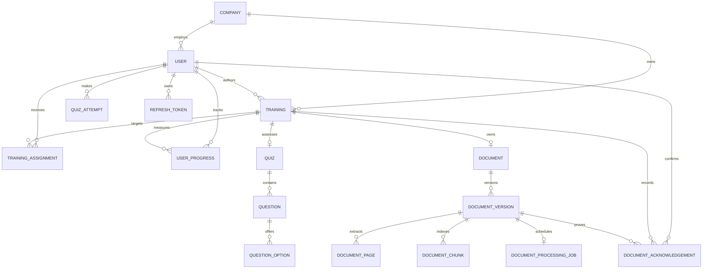

# Focused MVP Data Model

## Tenant boundary

`companies` is the ownership root. All company-scoped aggregates include a non-null `company_id`, and all uniqueness rules that describe company data include that key. Backend queries derive it from the authenticated user. Platform-only data is explicitly documented instead of silently omitting the tenant key.

## Relationship map

## Core entities

### Identity and organization

- `companies`: tenant identity, status, locale, timezone, and feature configuration.
- `users`: company membership, secure password hash, active state, and `ADMIN` or `EMPLOYEE` role.
- `refresh_tokens`: only hashed opaque refresh tokens, expiry, and revocation timestamps.

### Learning catalog

- `trainings`: `ARTICLE`, `VIDEO`, or `PDF` content with `DRAFT`/`PUBLISHED` lifecycle.
- `training_assignments`: employee targeting with optional due date and a uniqueness constraint per employee/training.
- `user_progress`: per-user percentage and started/completed timestamps.

### Assessment and proof

- `quizzes`, `questions`, and `question_options`: server-owned assessment definitions.
- `quiz_attempts`: immutable aggregate score evidence. Correct answers remain server-owned.

### Document intelligence

- `documents`: stable, company-scoped identity with one document per training.
- `document_versions`: immutable file metadata, checksum, private object key, monotonic version number, processing state, native/OCR counters, and safe error code.
- `document_pages`: one-based extracted page text and `NATIVE`, `OCR`, or `NONE` provenance retained for traceability.
- `document_chunks`: page-aware text plus 768-dimensional embedding provider/model metadata.
- `document_processing_jobs`: one durable job per version with claim lease, owner, attempt budget, retry availability, completion, and safe failure code.
- `document_acknowledgements`: immutable employee, attestation, filename, version, checksum, and timestamp snapshots, unique per employee/version.

Only the newest version of a document is eligible for retrieval, and it must be `READY`. The HNSW index uses `vector_cosine_ops` with `m=16` and `ef_construction=64`. A new document version leaves earlier acknowledgement rows untouched and becomes pending for every assigned employee. Learning paths, certificates, notifications, and general audit tables remain later scope.

## Integrity strategy

- Use UUID primary keys and timezone-aware timestamps.
- Prefer explicit foreign keys and database constraints for invariants.
- Use soft lifecycle states where history matters; do not silently overwrite evidence.
- Index tenant keys with common filter/sort columns.
- Store refresh tokens only as hashes.
- Use a vector index only after corpus size and query plans justify its parameters.

Migration `20260821_0001` enables PostgreSQL extensions. Migration `20260821_0002` creates the focused MVP schema. Migration `20260821_0003` adds document versions, pages, chunks, and the HNSW vector index. Migration `20260821_0004` adds durable document-processing jobs and claim indexes. Migration `20260822_0005` adds OCR provenance and immutable document acknowledgements.
